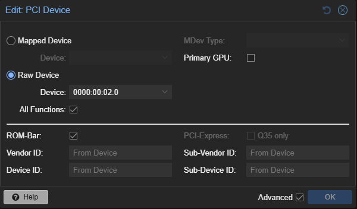
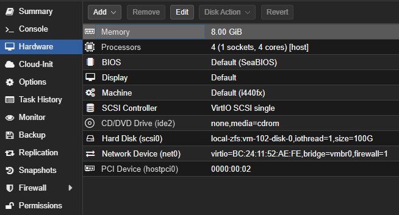
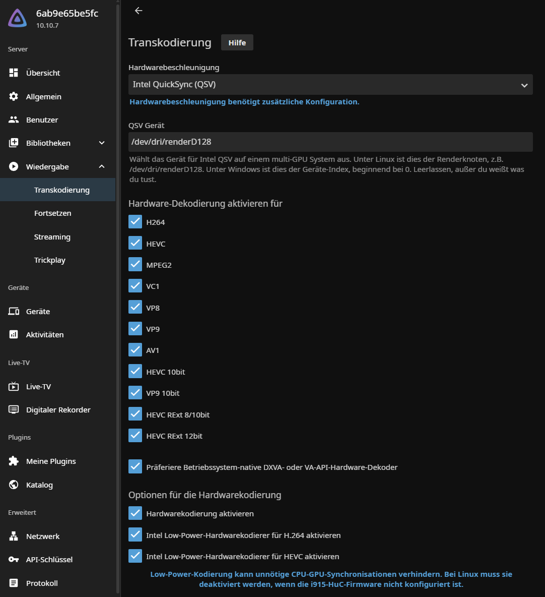

# 🎮 Intel iGPU Passthrough to Ubuntu VM

This guide documents how to passthrough the integrated GPU (iGPU) of an Intel CPU to an Ubuntu virtual machine running under Proxmox VE. It enables GPU-accelerated video encoding/decoding using Intel Quick Sync Video (QSV) and VAAPI — useful for media servers like Jellyfin.

---

> ⚠️ **IOMMU must be enabled** to pass through the iGPU. Follow the guide here: [Enabling IOMMU on Proxmox](./iommu.md)


### 🔍 Identify the iGPU PCI Address (on host)

Run this command on the **Proxmox host**:

```bash
lspci | grep VGA
```

Example:

```text
00:02.0 VGA compatible controller: Intel Corporation Alder Lake-S GT1 [UHD Graphics 770] (rev 0c)
```

Use the matching address when adding the PCI device to the VM in the Proxmox UI.

---

## ✅ VM Configuration in Proxmox

Set the following in the Proxmox VM:

| Setting         | Value               |
|-----------------|---------------------|
| Machine Type    | `i440fx`            |
| PCI Device      | `0000:00:02.0` (iGPU) |

- Enable: ✅ **All Functions** and ✅ **ROM-Bar**
- Leave ❌ "Primary GPU" **unchecked**

---

### 📸 Example Screenshots

**PCI Device Configuration**  


**VM Hardware Overview**  


---

## 📦 Ubuntu VM Setup

Install required packages for GPU access, monitoring, and video acceleration:

```bash
sudo apt update
sudo apt install ffmpeg
sudo apt install intel-media-va-driver-non-free libmfx1
sudo apt install intel-gpu-tools
```

---

## 📂 Device Verification

### 🧪 1. Confirm iGPU Presence with `lspci`

Run inside the **Ubuntu VM**:

```bash
lspci | grep VGA
```

Expected output:

```text
00:02.0 VGA compatible controller: Intel Corporation Alder Lake-S GT1 [UHD Graphics 770] (rev 0c)
```

If visible, the iGPU passthrough is active at the hardware level.

---

### 🧪 2. Check `/dev/dri`

```bash
ls -l /dev/dri/
```

Expected output:

```text
total 0
drwxr-xr-x 2 root root        100 Mär 29 20:56 by-path
crw-rw---- 1 root video  226,   0 Mär 29 20:56 card0
crw-rw---- 1 root video  226,   1 Mär 29 20:56 card1
crw-rw---- 1 root render 226, 128 Mär 29 20:56 renderD128
```

### What This Means:

- `card0`, `card1`: Represent different GPU endpoints (e.g., integrated vs. virtual display)
- `renderD128`: This is the key device used for **hardware video encoding/decoding** via VAAPI/QSV

---

## 🧪 Intel iGPU Hardware Acceleration Tests (FFmpeg)

These tests validate both Intel Quick Sync Video (**QSV**) and **VAAPI** on your passed-through iGPU using FFmpeg.

---

### 🎬 Step 1: Generate a 4K Test Video (Software-Encoded)

Create a synthetic test video (used by both QSV and VAAPI):

```bash
ffmpeg -f lavfi -i testsrc=duration=60:size=3840x2160:rate=30 \
  -c:v libx264 -pix_fmt yuv420p test_video.mp4
```

---

### ⚡ Step 2: Hardware-Accelerated Encoding

#### 🧪 Encode with QSV (H.265)

```bash
ffmpeg -hwaccel qsv -i test_video.mp4 \
  -c:v hevc_qsv -preset medium -b:v 3000k output_qsv.mp4
```

#### 🧪 Encode with VAAPI (H.264)

> Ensure `/dev/dri/renderD128` exists and is accessible.

```bash
ffmpeg -vaapi_device /dev/dri/renderD128 \
  -i test_video.mp4 \
  -vf 'format=nv12,hwupload' \
  -c:v h264_vaapi output_vaapi.mp4
```

---

### 📥 Step 3: Hardware-Accelerated Decoding

#### 🧪 Decode with QSV

```bash
ffmpeg -hwaccel qsv -i output_qsv.mp4 -f null -
```

#### 🧪 Decode with VAAPI

```bash
ffmpeg -vaapi_device /dev/dri/renderD128 \
  -hwaccel vaapi -hwaccel_output_format vaapi \
  -i output_vaapi.mp4 -f null -
```

---

### 🛠️ Monitor GPU Usage

Run this in a separate terminal while any of the above FFmpeg commands are active:

```bash
intel_gpu_top
```

You should see real-time activity on video decode and encode engines if acceleration is working.

---

## 🐳 Docker: Jellyfin with iGPU Support

You can use the iGPU in a Jellyfin container by exposing `/dev/dri`.

### `docker-compose.yml`

```yaml
services:
  jellyfin:
    image: jellyfin/jellyfin:latest
    container_name: jellyfin
    devices:
      - /dev/dri:/dev/dri
    volumes:
      - /path/to/config:/config
      - /path/to/media:/media
    restart: unless-stopped
```

---

### 🧩 Configure Jellyfin for Intel iGPU Acceleration

1. In the Jellyfin **Web UI**, go to:

   **Dashboard → Playback → Transcoding**

2. Under **Hardware Acceleration**:
   - Select: `Intel QuickSync (QSV)`

3. For **QSV Device**, enter:

   ```text
   /dev/dri/renderD128
   ```

4. Enable hardware decoding for all relevant formats (e.g., H264, HEVC, VP8, VP9, AV1, etc.)

5. Scroll down to the section **"Hardware encoding options"** and:
   - ✅ Enable hardware encoding
   - ✅ Optionally enable Intel low-power encoders for H.264 and HEVC

6. Click **Save**.

---

### 📸 Jellyfin Transcoding Settings Example

Below is a screenshot of a correctly configured Jellyfin instance using QSV:



---

## 🔗 Related Guides

- 🔐 [ZFS Configuration with OpenMediaVault](./zfs-setup.md)
- ⚙️ [Custom BIOS Power-Saving Configuration](../configs/bios-settings.md)
- 🔋 [Energy Management for Proxmox Host](../configs/energy-management.md)
