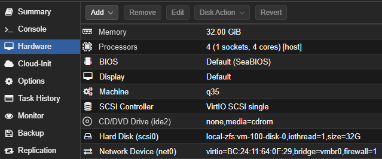
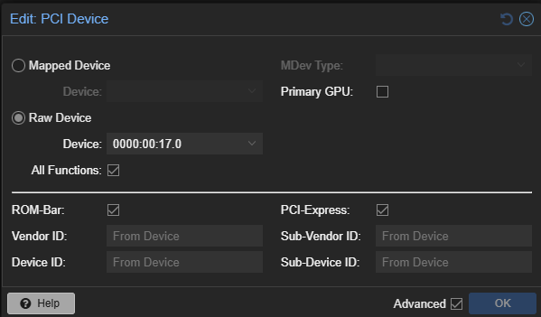
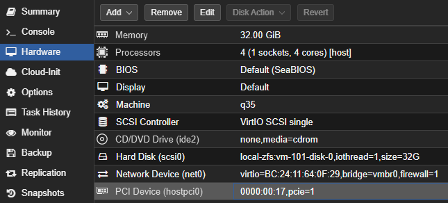
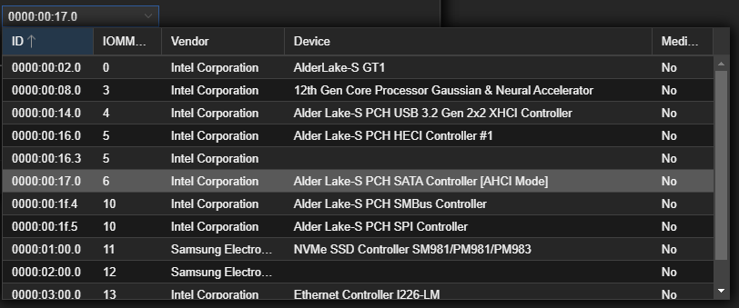

# 💾 ZFS Configuration with OpenMediaVault

This section documents how the ZFS storage pool is configured inside the OpenMediaVault (OMV) virtual machine with PCIe passthrough and encryption support.

---

## 1. Pass through the SATA Controller to the OMV VM

To enable SMART and full disk control inside OMV, the SATA controller must be passed through from Proxmox to the VM.

- a. Go to your OMV VM in Proxmox → **Hardware → Add → PCI Device**



- b. Select the **SATA controller** from the PCI device list.



- c. Confirm the device is added under the VM’s hardware list.



- d. Optional: Review all PCI devices passed to the VM.



- Start the OMV VM
- Check with `lspci` if the SATA controller gets recognized

```bash
lspci | grep SATA
```

- Check if the hard drives are detected using:

```bash
lsblk
```

Or via the **OMV Web UI → Storage → Disks**

---

## 2. Install the ZFS Plugin

- Install `omv-extras` from the OMV Web UI or CLI
- Install `openmediavault-zfs` (v7.1.1 or newer)

---

## 3. Create a ZFS Pool

### Unencrypted Pool

Use the **ZFS Plugin** in the OMV Web UI to create a new pool directly.

---

### Encrypted Pool (Manual Creation)

Create the pool from the OMV shell with full options:

```bash
zpool create \
  -o ashift=12 \
  -O encryption=aes-256-gcm \
  -O keyformat=passphrase \
  -O keylocation=prompt \
  -O compression=lz4 \
  -O atime=off \
  -O xattr=sa \
  -O recordsize=128K \
  -O acltype=posixacl \
  zfs_hdd_pool_01 \
  raidz \
  /dev/disk/by-id/ata-WDC_WD120EFBX-68B0EN0_XXXXXXXX \
  /dev/disk/by-id/ata-WDC_WD120EFBX-68B0EN0_XXXXXXXX \
  /dev/disk/by-id/ata-WDC_WD120EFBX-68B0EN0_XXXXXXXX
```

---

## 4. Explanation of ZFS Properties

| Option | Description |
|--------|-------------|
| `ashift=12` | Ensures 4K alignment, which is ideal for modern drives. |
| `compression=lz4` | Enables lightweight compression for better storage efficiency and performance. |
| `atime=off` | Disables atime updates to improve performance by avoiding unnecessary metadata writes. |
| `xattr=sa` | Optimizes extended attribute storage by storing it in system attributes, reducing metadata overhead. |
| `recordsize=128K` | Sets record size for general-purpose workloads and ensures clarity by overriding inherited values. |
| `acltype=posixacl` | Enables support for POSIX ACLs, useful for fine-grained permission control. |


---

## 5. Add Filesystem Entry to OMV Config

Insert a `mntent` entry into `/etc/openmediavault/config.xml`:

```xml
<mntent>
  <uuid>af26493c-d353-11ef-802d-b72d7c92b6e1</uuid>
  <fsname>zfs_hdd_pool_01</fsname>
  <dir>/zfs_hdd_pool_01</dir>
  <type>zfs</type>
  <opts>rw,noatime,nofail,noauto,xattr,posixacl</opts>
  <freq>0</freq>
  <passno>0</passno>
  <hidden>0</hidden>
  <usagewarnthreshold>85</usagewarnthreshold>
  <comment>ZFS HDD Pool</comment>
</mntent>
```

- Use `uuid` command to generate a unique ID:

```bash
uuid
```

- The UUID must be unique across the entire OMV config and will be referenced by SMB shares.

---

## 6. Manual Steps After Reboot

Encrypted ZFS pools need to be unlocked and mounted after reboot:

```bash
# Load the encryption key
zfs load-key zfs_hdd_pool_01

# Mount the pool
zfs mount zfs_hdd_pool_01
```

To automate this, use this existing [script](https://github.com/Rau-N/zfs-key-loader):

```bash
./zfs.sh
```

---
